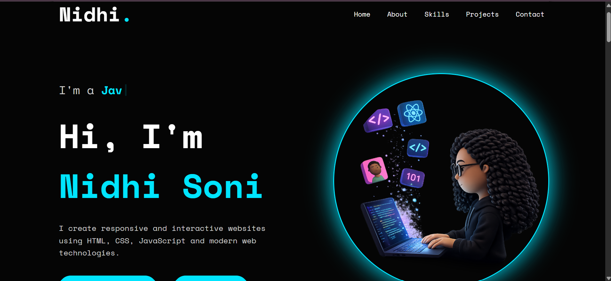

# 💼 Portfolio Website

A responsive personal portfolio website built to showcase my skills, projects, education, and contact information. The website provides an overview of my frontend development journey and highlights the projects I have developed.

## 🚀 Live Demo
🔗 https://your-portfolio-link.netlify.app *(Update after deployment)*

## 📂 GitHub Repository
🔗 https://github.com/nidhi-soni1203/portfolio

## ✨ Features

- Responsive design for desktop, tablet, and mobile
- Modern and clean user interface
- About Me section
- Skills section
- Projects showcase
- Resume download option
- Contact section
- Smooth scrolling navigation

## 🛠️ Technologies Used

- HTML5
- CSS3
- JavaScript
- Responsive Web Design

## 📸 Screenshot

## Author
Nidhi Soni

## ⭐ If you like this project

Give it a ⭐ on GitHub!
